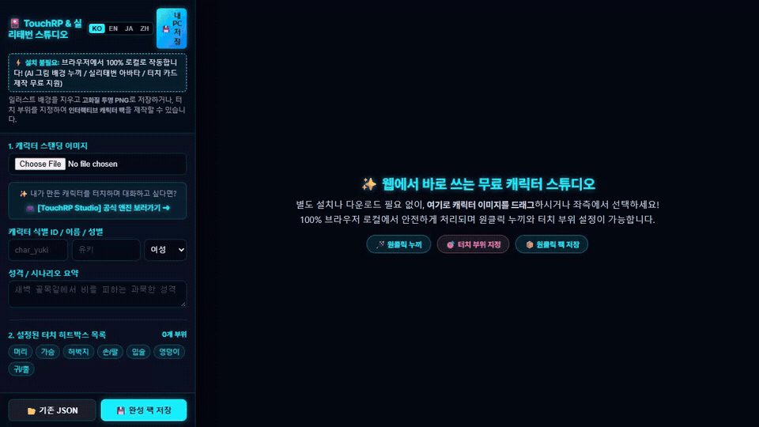

# 🎴 TouchRP Character Studio (Web Free Edition)

> **포토샵 없이 웹에서 10초 만에 끝내는 AI 그림 누끼 & 실리태번 / TouchRP 캐릭터 제작 툴**  
> **A zero-install free web tool to remove AI backgrounds, export high-quality transparent PNGs, and map interactive touch hitboxes in seconds.**

  
  &nbsp;&nbsp;
  

  

---

## 🎯 세 가지 목적으로 자유롭게 사용하세요!
1. **일반 AI 그림 누끼(배경 투명화)가 필요한 분**:
   - **단색 배경**: 원클릭 흰색/검은색 지우기 및 스팟 지우개로 0.01초 만에 깔끔 제거!
   - **복잡한 풍경 배경**: **`[🤖 AI 정밀 누끼]`** 버튼을 누르면 숲/거리 등 복잡한 배경 속 인물만 1초 만에 자동 오려내기!
   - **`[📥 고화질 투명 PNG 저장]`**으로 즉시 다운로드!
2. **실리태번(SillyTavern) 캐릭터 아바타를 만드는 분**:
   - 투명 PNG를 다운받아 실리태번 아바타로 바로 등록하여 사용할 수 있습니다.
3. **TouchRP 인터랙티브 롤플레이 카드를 만드는 분**:
   - 신체 부위별 터치 히트박스를 지정하고 대사를 작성하여 완성 캐릭터 팩(`.json`)을 제작할 수 있습니다.

> 💡 **AI 이미지 생성 꿀팁**:  
> AI 일러스트 생성 시 프롬프트에 `simple background`, `white background` 등 **단색 배경 프롬프트**를 넣어주시면, 캐릭터의 흰옷이나 안구를 파먹지 않고 0.1초 만에 가장 완벽한 고화질 투명 PNG가 완성됩니다! (복잡한 배경일 경우 **[🤖 AI 정밀 누끼]** 사용 가능)

---

## 🔞 연령 안내 및 면책 조항 (18+ Adult & Disclaimer)
- **18세 이상 창작자 지원**: 본 도구는 성인(18세 이상) 창작자의 비주얼 노벨 및 인터랙티브 캐릭터 카드 제작을 지원합니다.
- **100% 로컬 프라이버시**: 업로드하거나 편집하는 모든 이미지와 텍스트는 외부 서버로 전송되지 않으며, 사용자 브라우저 내부에서만 100% 로컬로 안전하게 처리됩니다.
- **창작물 권리 100% 귀속**: 본 툴은 완전 무료 오픈소스이며, 사용자가 본 툴을 통해 제작·수출한 이미지 및 캐릭터 팩(.png / .json / .zip)의 모든 권리는 제작자 본인에게 100% 귀속됩니다.

---

## 🌐 Languages / 언어별 안내
- [🇰🇷 한국어](#-한국어) | [🇺🇸 English](#-english) | [🇯🇵 日本語](#-日本語) | [🇹🇼 繁體中文](#-繁體中文)

---

## 🇰🇷 한국어
> **"완벽한 전문 그래픽 툴은 아니지만, 브라우저에서 10초 만에 흰옷 안 파먹고 누끼 따서 투명 PNG와 터치 카드를 만드는 가벼운 무료 툴입니다."**

### ⚡ 빠른 사용 방법
1. 상단의 **[🌐 웹에서 설치없이 바로 실행하기]** 버튼을 누르거나, HTML 파일을 다운로드하여 더블클릭합니다.
2. 스탠딩 이미지를 화면으로 끌어다 넣고 **[🪄 원클릭 외곽 흰색 지우기]**를 누르면 끝!
3. 다리 사이나 팔 틈새는 **[🎯 스팟 지우개]**로 콕 찍어 시원하게 뚫어줍니다.
4. **누끼만 쓸 경우**: `[📥 고화질 투명 PNG 저장]` 클릭!
5. **터치RP 카드까지 만들 경우**: 신체 부위를 마우스로 드래그하여 터치 영역을 지정하고 `[💾 완성 팩 저장]` 클릭!

### 🎮 TouchRP Studio와 연동하여 살아 숨쉬는 캐릭터 즐기기
여기서 만든 캐릭터 카드를 **[TouchRP Studio]** 본체 엔진에 넣으면, **내가 만든 최애 캐릭터를 직접 만지고(스킨십), 실시간 심장 박동과 부끄러워하는 반응을 느끼며 로컬 LLM으로 자유롭게 롤플레이 대화**를 즐길 수 있습니다!  
👉 **[TouchRP Studio 공식 링크트리 바로가기](https://bit.ly/4rqAR32)**

---

## 🇺🇸 English
> **"A lightweight zero-install web tool to remove AI illustration backgrounds cleanly, export transparent PNGs, and configure interactive touch hitboxes in seconds."**

### ⚡ Quick Guide
1. Click **[🌐 Launch Web Studio (Zero Install)]** above or download the single offline HTML file.
2. Drag & drop your character image onto the canvas.
3. Choose your background removal method:
   - **Solid / Simple Background**: Click `[⚪ Remove White Outline]` or use `[🎯 Spot Eraser]` to make gaps transparent in 0.01s without damaging white clothes!
   - **Complex Street / Scenery**: Click `[🤖 AI Precision BG Removal]` to automatically isolate the character via local WebAssembly AI.
4. **Transparent PNG**: Click `[📥 Save Transparent PNG]`.
5. **Interactive Touch Card**: Drag on the canvas to define hitboxes, choose body parts, and click `[💾 Export Pack]`.

### 🎮 Bring Your Characters to Life in TouchRP Engine
Import your exported `.json` into the **[TouchRP Studio Engine]** to touch, caress, sense dynamic heartbeats, and roleplay via local/cloud LLMs!  
👉 **[Visit Official TouchRP Linktree](https://bit.ly/4rqAR32)**

---

## 🇯🇵 日本語
> **"インストール不要！ブラウザ上で10秒で白服を削らず綺麗に背景透過PNGを作成し、インタラクティブなタッチ当たり判定を設定できる無料Webツールです。"**

### ⚡ クイック使い方
1. 上部の **[🌐 Webでインストールなしですぐ実行]** をクリックするか、HTMLファイルをダウンロードして開きます。
2. 立ち絵画像を画面にドラッグ＆ドロップします。
3. 背景透過の選択:
   - **単色・シンプル背景**: `[⚪ 白背景を透過]` をクリックするか、`[🎯 スポット消しゴム]` で隙間をワンクリックするだけで0.01秒で透過！
   - **風景・複雑な背景**: `[🤖 AI精密背景透過]` をクリックすると、AIが人物だけを自動抽出して背景を綺麗に除去します。
4. **透過PNGのみ保存**: `[📥 高画質透過PNG保存]` をクリック！
5. **タッチRPカード作成**: キャンバス上をドラッグして部位（頭・胸・太もも等）を指定し、`[💾 パック保存]` をクリック！

### 🎮 TouchRP Studio 本編エンジンとの連携
作成したキャラパックを **[TouchRP Studio]** に読み込むと、**キャラに触れてスキンシップを取りながら、リアルタイムの心拍数や恥じらいの反応を感じつつLLMと対話ロールプレイ**を楽しめます！  
👉 **[TouchRP Studio 公式リンク集はこちら](https://bit.ly/4rqAR32)**

---

## 🇹🇼 繁體中文
> **"無需安裝！在瀏覽器中 10 秒內快速清除 AI 插畫背景、匯出高清透明 PNG，並繪製互動觸摸區域的免費開源工具。"**

### ⚡ 快速上手指南
1. 點擊上方的 **[🌐 網頁即用 (免安裝)]** 按鈕，或下載單一離線 HTML 檔案開啟。
2. 將角色立繪圖片拖曳到工作區中。
3. 選擇去背方式：
   - **純色 / 簡約背景**：點擊 `[⚪ 去除白色外廓]` 或使用 `[🎯 吸管擦除]` 點擊縫隙，0.01 秒極速去背且不傷白衣！
   - **複雜街景 / 風景背景**：點擊 `[🤖 AI 智能摳圖]`，本機 WebAssembly AI 自動精準分離人物。
4. **僅需透明立繪**：點擊 `[📥 保存高清透明PNG]`！
5. **製作互動觸摸卡**：在畫布上拖曳選取觸摸區域（頭部、胸部、大腿等），然後點擊 `[💾 導出角色包]`！

### 🎮 連動 TouchRP 官方引擎享受生動互動
將匯出的角色包導入 **[TouchRP Studio]** 引擎，即可**親手觸摸角色（肢體接觸）、感受即時心跳與害羞反應，並透過 LLM 自由進行沉浸式角色扮演**！  
👉 **[前往 TouchRP Studio 官方傳送門](https://bit.ly/4rqAR32)**

---

## 📄 License
This project is open-sourced under the [MIT License](LICENSE).
